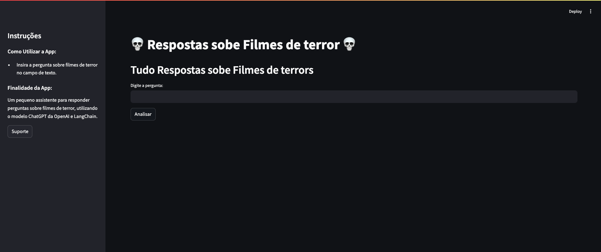

# FEAR — Film Experience And Reviews 🎬👻

A specialist **AI agent** for horror movies, built with **LangChain** and an **OpenAI** LLM, served through a **Streamlit** web app. Ask it about horror films, directors, subgenres, or recommendations and it answers in character as a horror-cinema specialist.

> Portfolio project, developed as a case study during my postgraduate program in AI Engineering (Data Science Academy). The name was, fittingly, suggested by an LLM.

## 🔴 Live demo

👉 **[rcsfearapp.streamlit.app](https://rcsfearapp.streamlit.app/)**



## What it demonstrates

- Building a **domain-specialist agent** with a guided system prompt and persona.
- **LangChain** question-answering chain wired to an OpenAI chat model.
- A shippable **Streamlit** interface, deployed publicly.
- API-key handling via `.env` *or* an in-app field, so anyone can try it with their own key.

## Project structure

| File | Purpose |
|---|---|
| `FEAR_App.py` | Streamlit web interface. |
| `QuestionAnswerChain.py` | LangChain Q&A chain + prompt wiring to the OpenAI model. |
| `requirements.txt` | Dependencies. |

## Running locally

```bash
pip install -r requirements.txt
streamlit run FEAR_App.py
```

**Configuration:** provide an OpenAI API key either by creating a `.env` file with `OPENAI_API_KEY="your-key"`, or by pasting it into the key field in the app sidebar.

## Tech stack

`Python` · `LangChain` · `OpenAI` · `Streamlit`

---

*Built by [Rogério Celestino](https://rogerioc.github.io/about/) — senior software engineer focused on Applied AI.*
